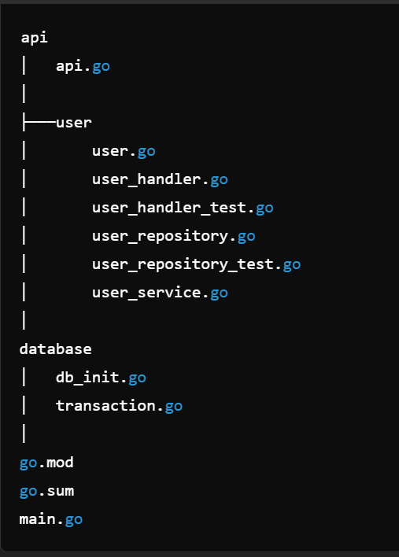

# demo-golang-rest-webserver
Covering the best practices of golang.

## Libraries
1. Go 1.22.4
2. go-sql-driver/mysql.
3. DATA-DOG/go-sqlmock for testing.

## Features
1. CRUD operations using standard MySQL library.
2. Webserver using standard HTTP Server, Handler.
3. Database rollback and commit.
4. Integration, Unit and Data Access Layer tests.

## Folder Structure
* transaction.go has been moved and renamed to utils.go

## Entity relationship
User 1 to many with Role.
